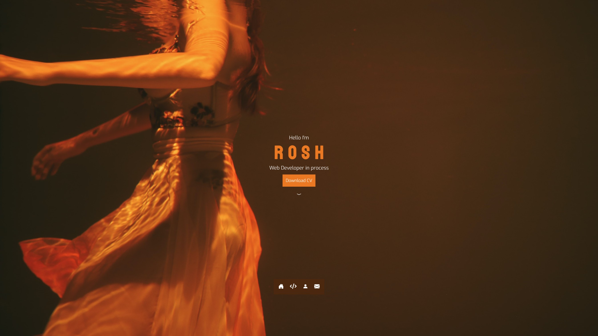

# My Portfolio
<ul>
  <li>Here I've made my responsive portfolio webpage by using HTML5 & CSS3</li>
  <li>It consists of Homepage, Skills and Project section, an About section and lastly Contact page</li>
  <li>Soon. I'll add PHP for the backend</li>
</ul>
Preview

