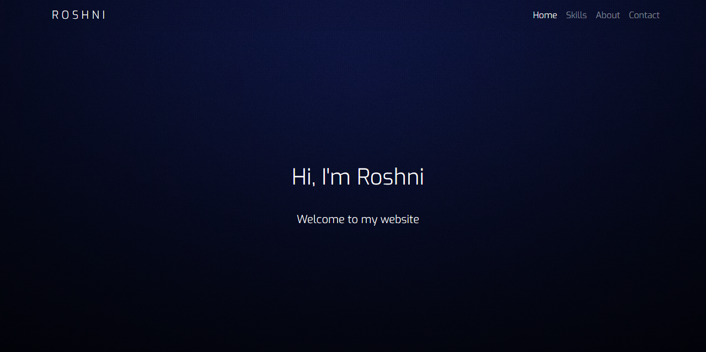

# My Portfolio

As you can see this is my portfolio website. I've listed my skills with the %age of how much I know about them.
Also, if you find any error in my code, notify me.
portfolio.html is the main file
